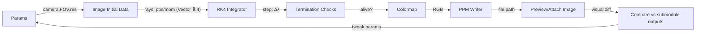

goal: port https://github.com/muphrid15/tetra-gray to lean 4. it's a general relativistic ray tracer that uses clifford algebra/tetrads.

as Cursor agent, use your ability to feed images in the loop to debug. See the
png in the repo for reference. Use the cpp code as a target to work against.

See all my previous TetraGray projects in `~` for past info. Cannibalize useful
bits of them, including the AGENTS.md/CLAUDE.md files.

Use `uvx lean-lsp-mcp` to get more feedback, and `lake build`.

Get to a iteration loop as fast as possible, and you'll succeed.

---

## Plan: CPU-only Lean 4 port with Vector α n and image loop

- Constraints
  - CPU-only (no CUDA). Start with small images for fast iteration.
  - Prefer `Vector α n` for fixed-size math objects (pos/mom/tetrads); use `Array` only when sizes are dynamic.
  - References: Lean language reference, upstream CUDA/C++ for parity.

- Module layout
  - `TetraGrayer/Core/Scalar.lean` – scalar aliases, small numeric helpers
  - `TetraGrayer/Core/Vector.lean` – helpers over `Vector α n`; Minkowski dot on `Vector ℝ 4`
  - `TetraGrayer/Camera.lean` – camera pose + HFOV → per-pixel ray `pos,mom : Vector ℝ 4`
  - `TetraGrayer/Integrator/RK4.lean` – generic RK4 over a photon state
  - `TetraGrayer/Termination.lean` – escape radius, max-steps, max-param checks
  - `TetraGrayer/Image/Colormap.lean` – spherical-like test colormap
  - `TetraGrayer/Image/PPM.lean` – simple CPU PPM writer
  - `TetraGrayer/Spacetimes/Flat.lean` – trivial RHS baseline
  - `TetraGrayer/Raytracer.lean` – compose pipeline; data-in → PPM-out

- Current status
  - Full raytracer implemented with Doran (Kerr) black hole spacetime
  - Metal GPU rendering with 241x speedup over CPU
  - CSE optimization in generated Metal shaders
  - Demo suite: accretion disk, checkerboard, starfield, wormhole
  - Documentation site: https://alok.github.io/TetraGrayer
  - Build: `lake build`; Run: `./.lake/build/bin/tetragrayer`
  - GPU: `./.lake/build/bin/tetragrayer metal-ffi`

- Potential future work
  - More spacetimes: Schwarzschild, Kerr-Newman, Reissner-Nordström
  - Interactive/real-time rendering
  - Animation support
  - Formal verification of physics equations

### Checklist
- [x] Add upstream as git submodule at `external/tetra-gray`
- [x] Create initial Lean module skeletons and exports
- [x] Implement simple PPM writer to `artifacts/`
- [x] Implement camera and per-pixel ray generation
- [x] Implement generic RK4 and state update
- [x] Add escape radius, max-steps termination checks
- [x] Implement spherical test colormap for rays
- [x] Wire flat pipeline and render 256x144 PPM
- [x] Match upstream flat params and compare output
- [x] Port Cartesian↔spheroidal helpers
- [x] Scaffold tetrads and Doran RHS in Lean
- [x] Add adaptive stepsize and ratio-based stop
- [x] Render small Doran image and iterate
- [x] Metal GPU codegen with CSE optimization
- [x] Metal FFI for GPU rendering (241x speedup)
- [x] Demo suite: accretion disk, checker, stars, wormhole
- [x] Documentation site with GitHub Pages deployment
