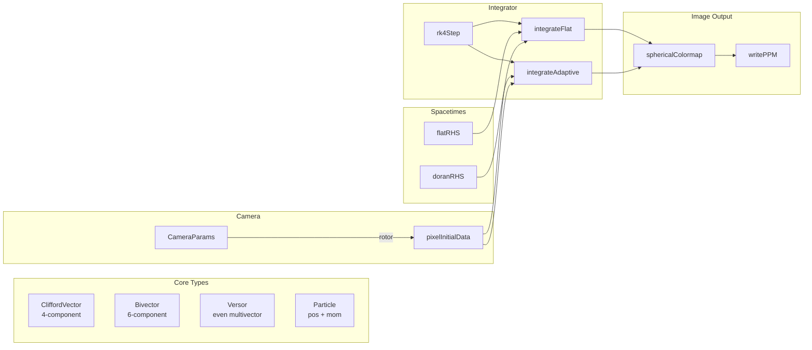

# TetraGrayer Lean 4 Improvement Plan

## Current Status

The Lean 4 port successfully renders flat spacetime images matching upstream within 0.01% pixel accuracy. The Doran (Kerr) black hole integration is implemented but untested against upstream.

## Architecture Overview



## Improvement Areas

### 1. Code Cleanup & Consolidation

**Priority: High**

- [ ] Remove duplicate modules (Camera.lean vs Camera2.lean, Raytracer.lean vs Raytracer2.lean, Colormap.lean vs Colormap2.lean)
- [ ] Consolidate into single clean implementations
- [ ] Remove unused legacy aliases in `Integrator/Generic.lean`
- [ ] Clean up linter warnings (missing docs, unused variables)

### 2. Type Safety with Dependent Types

**Priority: Medium**

Replace raw `CliffordVector` with typed wrappers for safety:

```lean
-- Instead of CliffordVector for everything:
structure Position where
  vec : CliffordVector

structure Momentum where
  vec : CliffordVector
  null : vectorDot vec vec = 0  -- photon constraint (optional proof)

structure SphericalCoord where
  r : ℝ
  theta : ℝ
  phi : ℝ
  theta_bound : 0 ≤ theta ∧ theta ≤ π  -- (optional proof)
```

### 3. Algebraic Structure Instances

**Priority: Medium**

Implement proper Mathlib-style algebraic instances:

```lean
-- CliffordVector as a module over ℝ
instance : Module ℝ CliffordVector where
  add_smul := ...
  zero_smul := ...

-- Versor as a monoid under multiplication
instance : Monoid Versor where
  mul := versorMul
  one := Versor.one
  mul_assoc := sorry  -- proof
  one_mul := sorry
  mul_one := sorry

-- Inner product space structure
instance : Inner ℝ CliffordVector where
  inner := vectorDot
```

### 4. SIMD/Parallel Optimization

**Priority: Medium**

The current implementation is single-threaded. Options:

- [ ] Use `IO.mapTasks` for parallel pixel rendering
- [ ] Investigate Lean 4 SIMD intrinsics for vector operations
- [ ] Consider external FFI to optimized C/CUDA for performance-critical inner loops

### 5. Termination Proofs (Optional)

**Priority: Low** (per user preference)

Currently using `partial def` or fuel-based recursion. Could prove termination:

```lean
-- For integrateFlat, structural recursion on Nat fuel already works
-- For adaptive stepping, would need well-founded recursion on affine parameter
```

### 6. Test Infrastructure

**Priority: High**

- [ ] Add Doran image comparison test (once upstream reference is generated)
- [ ] Unit tests for Clifford algebra operations
- [ ] Property-based tests: rotor composition, null vector preservation
- [ ] CI integration (already have `lean_action_ci.yml`)

### 7. Numeric Precision

**Priority: Medium**

- [ ] Audit Float vs Double usage (Lean 4 Float is 64-bit)
- [ ] Add tolerance-aware comparisons where needed
- [ ] Consider using exact rational arithmetic for critical sections

### 8. Documentation

**Priority: Low**

- [ ] Add module-level docstrings explaining the physics
- [ ] Document coordinate conventions (Cartesian vs spherical vs spheroidal)
- [ ] Add references to Doran & Lasenby, Bohn et al.

### 9. Feature Parity with Upstream

**Priority: Medium**

Missing features from upstream tetra-gray:

- [ ] Schwarzschild metric (a=0 special case of Doran)
- [ ] Accretion disk visualization
- [ ] Animation support (moving camera)
- [ ] PNG output (currently PPM only)

### 10. Performance Profiling

**Priority: Medium**

- [ ] Profile render times: flat vs Doran, small vs full resolution
- [ ] Identify hotspots (likely: RK4 inner loop, spheroidal transforms)
- [ ] Compare against upstream CUDA times as benchmark

## Proposed Refactoring Steps

### Phase 1: Cleanup (1-2 hours)

1. Delete `Camera.lean`, `Colormap.lean`, `Raytracer.lean` (keep *2 versions)
2. Rename `*2.lean` files to remove suffix
3. Update imports in `TetraGrayer.lean`
4. Fix all linter warnings
5. Run test to verify nothing broke

### Phase 2: Type Safety (2-3 hours)

1. Create `Position`, `Momentum` wrapper types
2. Update `Particle` to use them
3. Create `SphericalCoord`, `SpheroidalCoord` types
4. Update coordinate transform functions
5. Fix all type errors

### Phase 3: Algebraic Instances (2-3 hours)

1. Define `AddCommGroup CliffordVector`
2. Define `Module ℝ CliffordVector`
3. Define `Monoid Versor`
4. Add basic lemmas (optional proofs with sorry)
5. Refactor to use standard operators

### Phase 4: Parallelization (3-4 hours)

1. Wrap pixel computation in `IO.mapTasks`
2. Benchmark improvement
3. Consider chunking strategy for cache efficiency
4. Handle IO.println progress reporting in parallel context

### Phase 5: Testing & CI (2-3 hours)

1. Generate upstream Doran reference image
2. Add Doran comparison to `test_comparison.sh`
3. Add unit tests for Clifford operations
4. Configure CI to run tests on push

## Quick Wins

1. **Remove duplicates** - 10 min, reduces confusion
2. **Fix linter warnings** - 15 min, cleaner output
3. **Add Doran test** - 30 min, more confidence
4. **Parallel rendering** - 1 hour, 4-8x speedup

## Non-Goals

- GPU/CUDA support (out of scope for pure Lean)
- Full termination proofs (per user preference)
- Bitwise identical output (floating-point differences acceptable)
