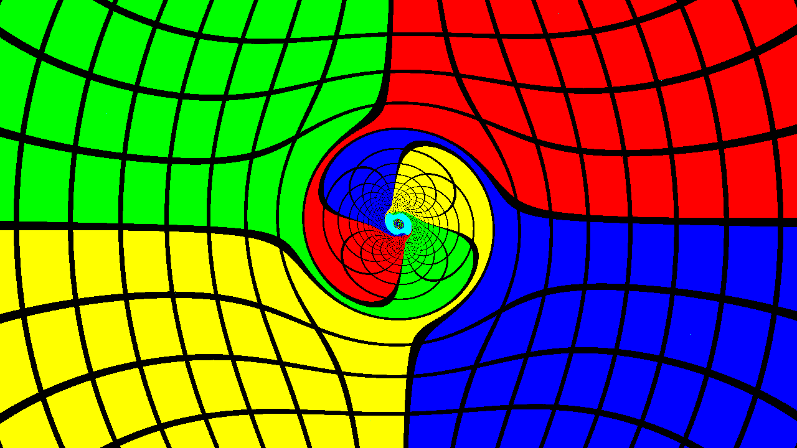

# TetraGrayer

General relativistic ray tracer in Lean 4, ported from [tetra-gray](https://github.com/muphrid15/tetra-gray).



*Kerr black hole with spin parameter a=0.5, rendered in 0.18s on Apple M4 Max using Metal GPU acceleration.*

## Features

- **Clifford Algebra**: Full spacetime algebra with (-,+,+,+) signature
- **Doran Coordinates**: Horizon-penetrating coordinates for Kerr black holes
- **RK4 Integration**: Adaptive geodesic integration with termination checks
- **Metal GPU**: ~70x speedup via Apple Metal compute shaders
- **Dependent Types**: Compile-time verification of buffer sizes, parameter bounds

## Quick Start

```bash
# Build
lake build

# Render on Metal GPU
./.lake/build/bin/tetragrayer metal-ffi

# CPU rendering
./.lake/build/bin/tetragrayer doran
```

## Architecture

```
TetraGrayer/
├── Core/           # Clifford algebra, coordinates, scalars
├── Integrator/     # Generic RK4 with monadic interface
├── Spacetimes/     # Doran (Kerr), Flat, Wormhole
├── Render/         # Metal FFI, parallel CPU, shader uniforms
└── Image/          # PPM output, colormaps
```

## Requirements

- Lean 4.25+
- macOS with Metal GPU (for GPU acceleration)
- ImageMagick (optional, for image conversion)
